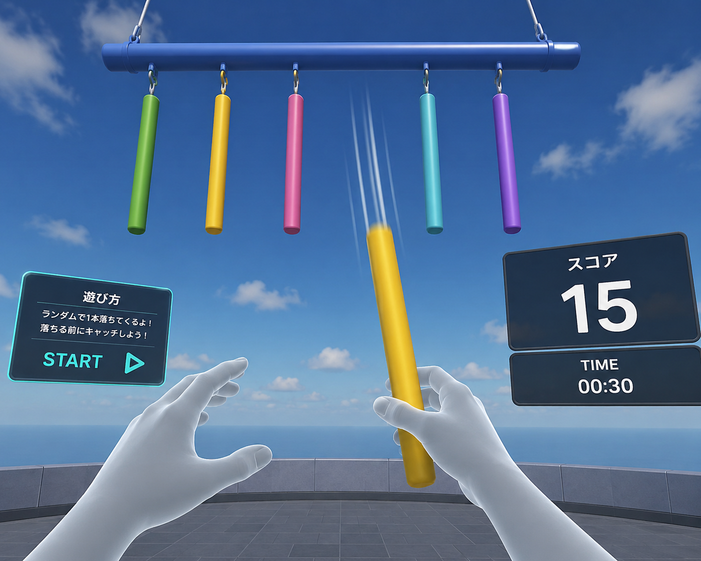

# VRキャッチスティックゲーム - 企画概要



---

# 概要

本プロジェクトでは、UnityとVRハンドトラッキングを用いて、反射神経をテーマとしたVRキャッチゲームを制作する。

プレイヤーの前方上部には複数の棒が横向きの支柱から吊り下げられており、その中からランダムな1本が突然落下する。

プレイヤーはハンドトラッキングを用いて素早く棒を掴み、スコアを獲得する。

---

# ゲーム内容

1. プレイヤーは前方のSTARTボタンを押してゲームを開始する。  
2. 上部に並んだ複数の棒の中から、ランダムな1本が落下する。  
3. プレイヤーはハンドトラッキングを用いて棒を掴む。  
4. 棒を掴むとスコアが加算される。  
5. スコアは前方UIに表示される。  

また、棒を掴んだ際には効果音を再生し、ゲーム体験の向上を図る。

---

# 主な機能

## 1. ハンドトラッキング

コントローラーを使用せず、手を使って直接ゲームを操作する。

---

## 2. UI操作

前方に配置したUIボタンを指で押し、ゲームを開始する。

---

## 3. 棒の落下システム

上部の支柱に並んだ複数の棒の中から、ランダムな1本を選択して落下させる。

---

## 4. オブジェクトの掴み判定

XR Grab Interactable を使用し、落下する棒を掴めるようにする。

---

## 5. スコアシステム

棒を掴むたびにスコアを加算し、UI上にリアルタイムで表示する。

---

## 6. 効果音の再生

棒のキャッチ成功時に効果音を再生し、フィードバックを行う。

---

# シーン構成

```text
Scene
├── XR Origin
├── XR Interaction Manager
├── Plane
├── UI Canvas
├── GameManager
├── StickHolder
│   ├── Stick1
│   ├── Stick2
│   ├── Stick3
│   ├── Stick4
│   └── Stick5
└── AudioManager
```

---

# 使用スクリプト

## GameManager.cs

- ゲーム開始
- スコア管理
- UI更新
- ゲーム進行管理

---

## StickManager.cs

- ランダムな棒の選択
- 棒の落下制御
- 棒の初期位置リセット

---

## Stick.cs

- 掴み判定
- スコア通知
- 効果音再生
- 落下状態管理

---

# 今回の到達目標

- ハンドトラッキングで操作できる
- 落下する棒を掴める
- スコアが表示される
- 効果音が再生される
- VRゲームとして動作する
